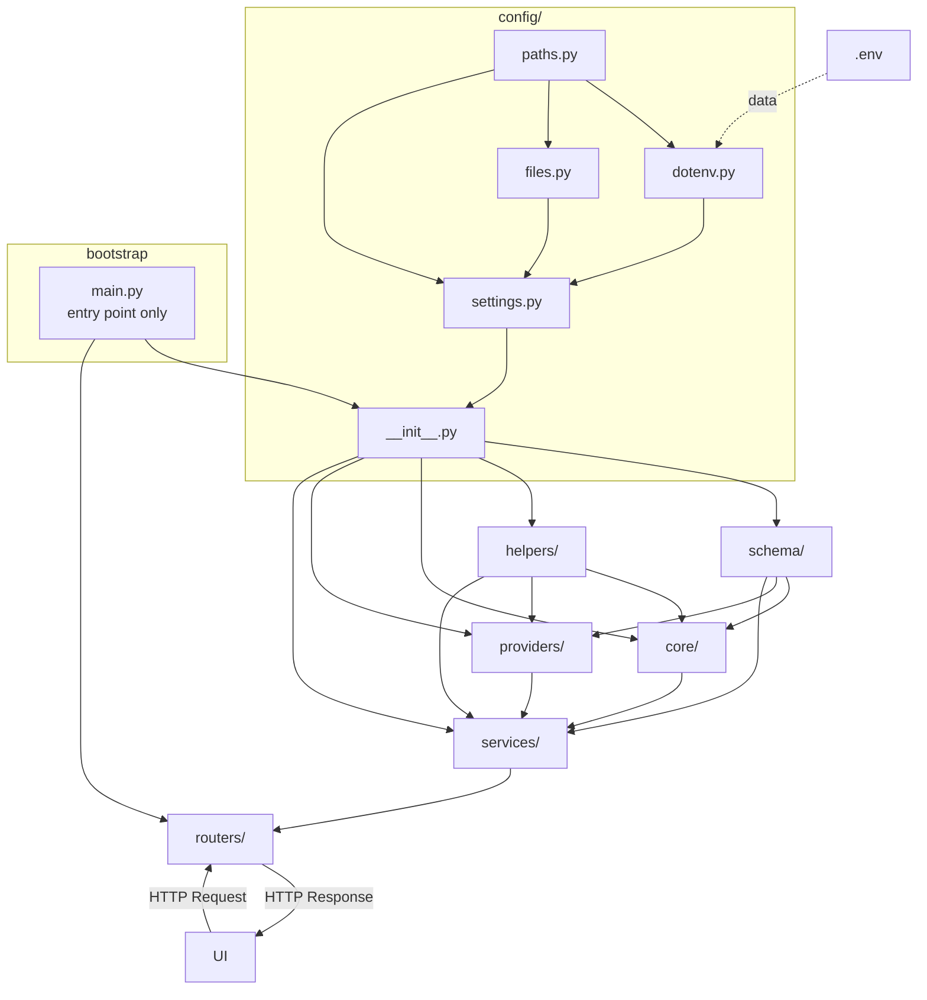

# Architecture Patterns

## 1. Universal Dependency Flow

> *"Water never flows upward — imports always flow downward."*



**Import Permission Table:**

| Module | Can Import From | Blind To |
|:---|:---|:---|
| `config/` | `.env` (data only) | everything |
| `schema/` | `config/` | `core`, `providers`, `services`, `routers` |
| `helpers/` | `config/` | `core`, `providers`, `services`, `routers` |
| `core/` | `config/`, `schema/`, `helpers/` | `providers/`, `services/`, `routers/` |
| `providers/` | `config/`, `schema/`, `helpers/` | `core/`, `services/`, `routers/` |
| `services/` | `config/`, `schema/`, `helpers/`, `core/`, `providers/` | `routers/` |
| `routers/` | `services/`, `schema/` | `core/`, `providers/`, `helpers/` |
| `main.py` | `config/`, `routers/` | internal business logic |

---

## 2. The Structural Blueprint (Dependency & Directory Rules)

### 2.1 Dependency Rule
> *"Imports flow in one direction"*

The core rule of clean architecture is that imports should always be unidirectional to prevent circular dependencies. Correctly executing a Strict Dependency Rule exponentially increases the Scalability and Maintainability of a project.

#### 1. Top-level Isolation
Each folder in the project, such as `config`, `schema`, `api`, `browser`, `session`, `providers`, `tools`, `services`, will act as an independent module. None shall interfere with the internal affairs of another.

#### 2. Layer Trust / Unidirectional Flow

**The Core Truth:**
!- `root/.env` is the Single Source of Truth for project environment variables. It manipulates `src/config/settings.py`. For example: `LOG_DIR=logs`, `JINA_API_KEY=abcd`
- `src/config/`:
  - `src/config/settings.py` is the gearbox of the entire project. The environment driver controls the project through this gearbox.  
    *(For example: `LOG_DIR: str = Field(default="logs", validation_alias="LOG_DIR")`, `@property \n def LOG_DIR(self) -> Path: \n return self._resolve_path(self.LOG_DIR)`)*
  - `src/config/dotenv.py`
  - `src/config/__init__.py`
- `src/schema/`: This directory holds the absolute truth for **Pydantic modeling** standards (`models.py`). It does not import or call any local modules; rather, the entire project depends on it.

**Dependency Privacy:**
!- `src/{module}/helpers/`: Each module can have its own `helpers/` folder. These helpers are entirely private. Meaning, one module like `src/api/*` or `src/api/__init__.py` will never import or call the private helpers of another module like `src/{module}/helpers/*`. These `helpers` can only be called by their respective `src/{module}/*`.
- `src/helpers/`: If any global helper logic (e.g., date formatting, logging) is needed across multiple modules, it belongs in the project root `src/helpers/`. Everyone is allowed to import or call these globally.

**Core Infrastructures:**
- **`src/core/`**: Knows `src/schema/__init__.py`, `src/config/__init__.py`, and `src/helpers/`.
- **`src/providers/`**: Knows `src/schema/__init__.py`, `src/config/__init__.py`, and `src/helpers/`. Peer of `core/` — they are blind to each other.
- **`src/services/`**: The **fan-in point**. Knows `src/core/__init__.py`, `src/providers/__init__.py`, `src/schema/__init__.py`, `src/config/__init__.py`, and `src/helpers/`. This is where `core/` and `providers/` converge.
- **`src/routers/`**: Only knows `src/services/__init__.py` and `src/schema/__init__.py`. No business logic — HTTP interface only.
!- **`src/api/frontend/`**: Merely used to represent `src/services/*` to the frontend.
!- **`src/tools/`**: If tools are utilized to build a Model Context Server or Function Calling Interface for the agent, they act like a CLI interface that calls `src/services/*`. They take arguments as input and return structured outputs.

### 2.2 Directory Structure Rules

**Rule 1 — Directory Name = Its Responsibility**
A directory's name strictly defines its single responsibility.
All scripts inside that directory must cover the sub-responsibilities of that exact context.

```bash
providers/    ← AI/external service integrations ONLY
core/         ← Business logic ONLY
helpers/      ← Global utilities that assist the entire project ONLY
config/       ← All configuration ONLY
tools/        ← Reusable standalone operations ONLY
```

**Rule 2 — `/config/` is the Single Source of Truth**
If there are hardcoded or scattered parameters anywhere in the project, they must be migrated to `/config/`. The `__init__.py` file aggregates and exposes all configs.

```python
# ❌ Avoid
MODEL = "gpt-4o"  # hardcoded inside core/agent.py

# ✅ Prefer
class LLMConfig(BaseSettings):
    model: str = "gpt-4o"
```

**Rule 3 — Sub-Responsibility Allowed, Cross-Responsibility Forbidden**

```bash
providers/
├── openai.py        ✅ Sub-responsibility of "providers"
├── anthropic.py     ✅ Sub-responsibility of "providers"
└── formatter.py     ❌ This is the job of helpers/
```

**Cross-Responsibility Violation — Detection & Fix:**

```bash
# ❌ Violation
helpers/
└── gemini_caller.py     ← AI Provider call — what is this doing in helpers/?

# ✅ After fix
providers/
└── gemini.py            ← Migrated to the correct location
```
